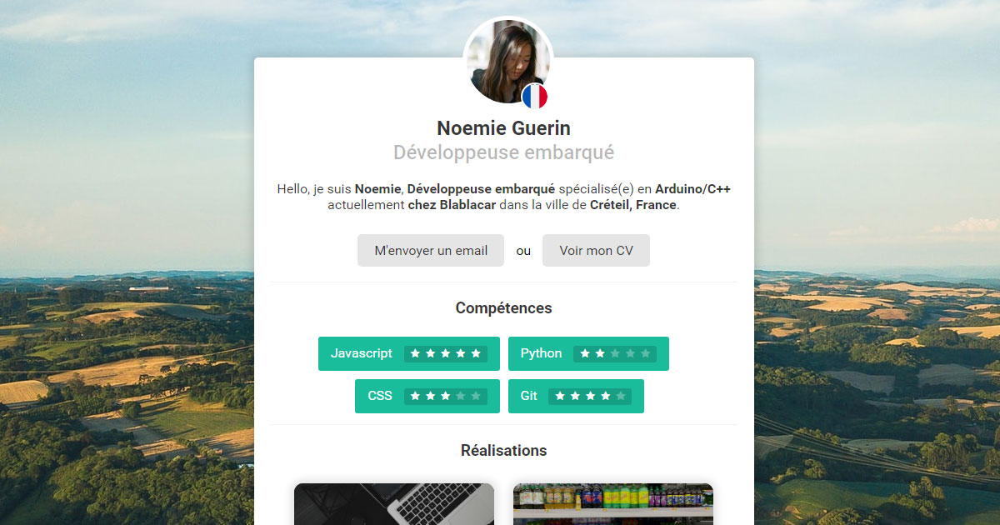

# John Doe
John Doe is a minimalist personal website template made for developers built using only plain html, css and javascript.

Live demo is available here: [https://nicolasbrondin.github.io/john-doe/index.html](https://nicolasbrondin.github.io/john-doe/index.html)

## How to use it

Each time you load the page, it will load a random person infos and a random wallpaper. 

This is not made to be published like this. Simply fork the project, disable the javascript script and fill the html template with your infos.

You can publish the website on any static hosting service, very easily.

Please don't forget to change all the metadata, it has been built to be SEO and Social Media friendly for your convenience :)

## Acknowledgements
All the random wallpapers are generated from the unsplash API and the user content from the randomuser.me API !
